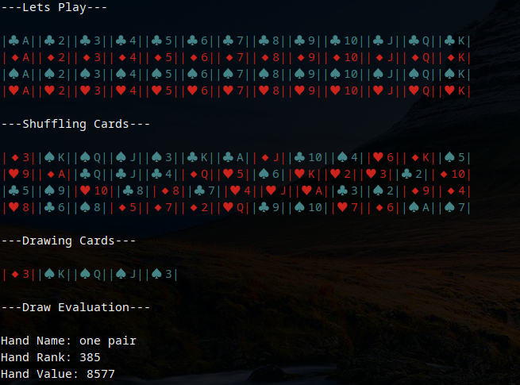

# PokerShuffle

## Description
This is an app to simulate a poker hand draw and evaluation

## Requirements
* This application has been tested on Ubuntu 20.04 LTS with NodeJS 12.18.3 installed

## How do I get it set up?
* Install NodeJS 12.18.3 (Older versions will probably also work)
* In some cases the Mocha unit testing library and Typescript needs to be installed globally
`$ npm install mocha -g && npm install typescript -g`

## How do I run this?
* The shell script run.sh will build and run the application
`$ ./run.sh`
* If the shell script fails for whatever reason , run the following commands manually
`$ npm install && npm run start`
